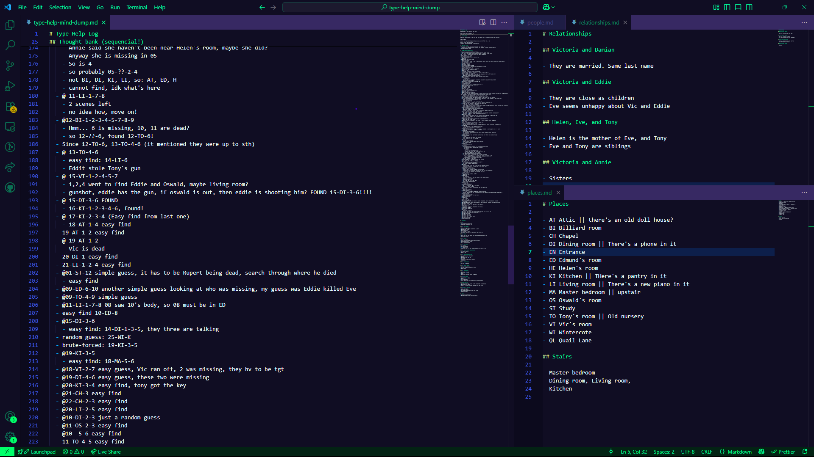

# Type Help Mind Dump

This is my personal log and notes for the game [Type Help](https://william-rous.itch.io/type-help) by William Rous.

If you found this, feel free to browse, but don't expect anything polished or organized.

## About

- I played Type Help and kept this mind-dump instead of using the in-game notes.
- Thanks to a friend for recommending the game (name not specified).
- All credit for the game goes to William Rous.

> [!WARNING]
> This document contains major spoilers for Type Help.
> If you haven’t played the game, you may want to stop reading now!

> [!WARNING]
> This document contains major spoilers for Type Help.
> If you haven’t played the game, you may want to stop reading now!

> [!WARNING]
> This document contains major spoilers for Type Help.
> If you haven’t played the game, you may want to stop reading now!

> [!WARNING]
> This document contains major spoilers for Type Help.
> If you haven’t played the game, you may want to stop reading now!

> [!WARNING]
> This document contains major spoilers for Type Help.
> If you haven’t played the game, you may want to stop reading now!

## My Setup & Approach

- I used two monitors: one for the game, one for my VSCode to keep track of my notes.
- At some point, I realized that thunderclap events in the game signal a character's death. I started marking each death as it happened.
- I used the `find` command to search for "Thunderclap" in my notes and marked each death, noticing they occur sequentially from 11 down to 1.
- This helped me understand the story and brute-force most scenes, especially after the exciting part where Annie and John struggle before their deaths.
- I also marked an `X` once I realized all numbers (characters) are found in their appropriate scenes.



## Game Snippets

```txt
Displaying 12 set names.

1 - John Hobbes
2 - Annie Beaumont
3 - Oswald Brian Arthur Galley
4 - Tony Dauer
5 - Martha Galley
6 - Eddie Galley
7 - Victoria Beaumont/Maseko
8 - Damian Maseko
9 - Helen Dauer
10 - Eve Dauer
11 - Harry Thornton
@ - haha
```

```txt
ACT I ..... IGNORANCE
00 (#) Intro
01 X | Encounter | Knock
02 X | Greets | Tony throws doll from AT to EN
03 X | More Greetings
04 X | Vic gave sth wearable to Annie | 11 is dead
05 X |6-7 found Eve's ring | Chapel key is found with the 1st body
06 X | Damian brings Eve to bed
```

```txt
ACT II .... CONFUSION
07 X | Dinner time | 11 died
08 X | 11 body found | Eve hid watch for Tony in ED | Crazy Oswald
09 X | 10 died
10 X
11 X
12 X | 9 died | Big drama in Billiard room
13 X | 8 died | the night
```

```txt
ACT III ... TERROR
14 X | Vic found new body | ghosts? read 14-AT
15 X | gunshot
16 X
17 X
18 X | 7 died here
19 X | 6 died
20 X | 5 died
```

```txt
ACT IV .... THE RECKONING
<<----       
21 X | 4 died
22 X | 3 died
23 X | 2 died
```
